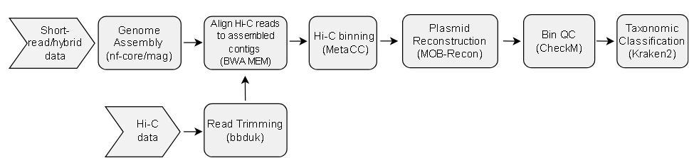

# HiCPlas: Documentation

Nextflow pipeline for reconstructing plasmids and associating them to their bacterial host using Hi-C metagenomic data 



## Usage

#### Input
This pipeline takes as input a samplesheet containing paths to the metagenomic reads. This samplesheet is the same as one would include for [nf-core/MAG](https://nf-co.re/mag/2.5.4/docs/usage/) and include these columns: "sample,group,short_reads_1,short_reads_2,long_reads". Paths to short_reads_2 and long_reads are optional. Additionally, a path to the paired Hi-C reads must be specified under the --hic_read flag. 

### Parameters
```
--outdir: output folder
-enzyme (optional): Case-sensitive enzyme name. Use multiple times for multiple enzymes 
--hybrid(true or false):Assemble using hybrid reads. Default false
```

### Example Usage


```sh
nextflow run main.nf -profile singularity -c custom.config --input path_to_samplesheet.csv --outdir HiCPlas_results --hic_read "path_to_hic_read/sample_{1,2}.fastq.gz
```
