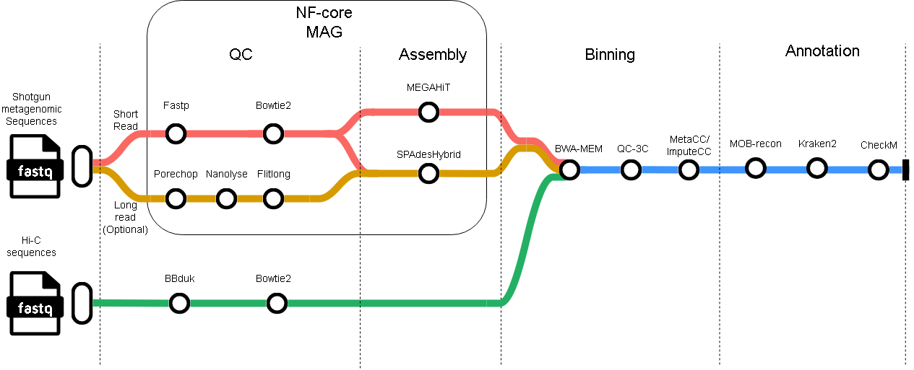

# HiCPlas: Documentation

Nextflow pipeline for reconstructing plasmids and associating them to their bacterial host using Hi-C metagenomic data.



## Overview
This pipeline requires both metagenomic and Hi-C reads from the same sample. It performs quality control and assembly of the shotgun metagenomic reads using nf-core/MAG, as well as quality control of the Hi-C reads. Binning is carried out with either MetaCC or ImputeCC, including an assessment of the number of informative Hi-C reads using QC3C. From the resulting bins, plasmid sequences are predicted with MOB-recon, taxonomic classification is performed with Kraken2, and bin quality is evaluated with CheckM [6]. The pipeline concludes by reporting the genus and species of bins that pass quality control.
## Usage

#### Input
This pipeline takes as input a samplesheet containing paths to the metagenomic reads. This samplesheet is the same as one would include for [nf-core/MAG](https://nf-co.re/mag/2.5.4/docs/usage/) and include these columns: "sample,group,short_reads_1,short_reads_2,long_reads". Paths to short_reads_2 and long_reads are optional. Additionally, a path to the paired Hi-C reads must be specified under the --hic_read flag. 

### Parameters
```
--outdir: output folder
-enzyme (optional): Case-sensitive enzyme name. Use multiple times for multiple enzymes 
--hybrid(true or false):Assemble using hybrid reads. Default false
```

### Example Usage


```sh
nextflow run main.nf -profile singularity -c custom.config --input path_to_samplesheet.csv --outdir HiCPlas_results --hic_read "path_to_hic_read/sample_{1,2}.fastq.gz
```

## Credits

This pipeline was built by me as part of my Master's thesis at Simon Fraser University. It was created using computational resources from my lab [CIDGOH](https://cidgoh.ca) genomics group.

<!--

## Contributions and Support

If you would like to contribute to this pipeline, please see the [contributing guidelines](.github/CONTRIBUTING.md).

For further information or help, don't hesitate to get in touch on the [Slack `#bacpaq` channel](https://nfcore.slack.com/channels/bacpaq) (you can join with [this invite](https://nf-co.re/join/slack)).
-->

## Citations

An extensive list of references for the tools used by the pipeline can be found in the [`CITATIONS.md`](CITATIONS.md) file.

You can cite the `nf-core` publication as follows:

> **The nf-core framework for community-curated bioinformatics pipelines.**
>
> Philip Ewels, Alexander Peltzer, Sven Fillinger, Harshil Patel, Johannes Alneberg, Andreas Wilm, Maxime Ulysse Garcia, Paolo Di Tommaso & Sven Nahnsen.
>
> _Nat Biotechnol._ 2020 Feb 13. doi: [10.1038/s41587-020-0439-x](https://dx.doi.org/10.1038/s41587-020-0439-x).
